# Tutorial: Use Hugging Face Transformers with MongoDB Database Trigger

This repository contains code and instructions on how to integrate Hugging Face Transformers with MongoDB using Database Triggers to enrich your documents with state-of-the-art Machine Learning.

In thit tutorial you will learn how to set up Triggers to automatically predict the sentiment of new documents in your MongoDB database and add them as additional fields to your documents.

# Tutorial

## 0. Prequisition

Running MongoDB Atlas cluster [Try for free if you don't have one](https://www.mongodb.com/cloud/atlas/register)

Below you can find an example image of how this looks

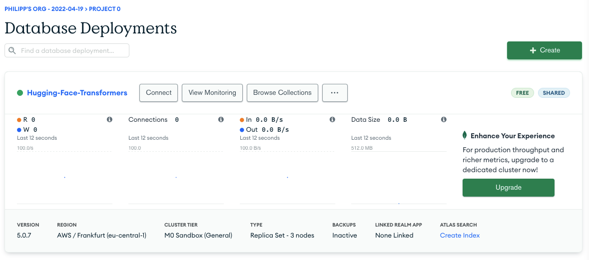


We will use the Console (UI) in this tutorial, but can also use the APIs to interact with the database.

## 1. Create a Cluster and Database 

As first we need to create a new database and collection. We can do this by navigating to "Database" in the left menu and clicking "Browse Collections".

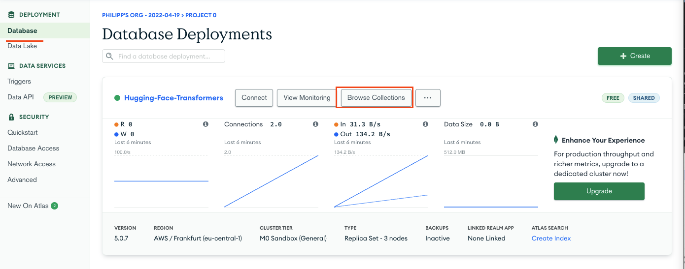

After that we need to click on "Add My Own Data" and can then define our database name and collection name, e.g.

Database name: `HuggingFace`
Collection name: `SupportTickets`

To create the database and collection click "Create".

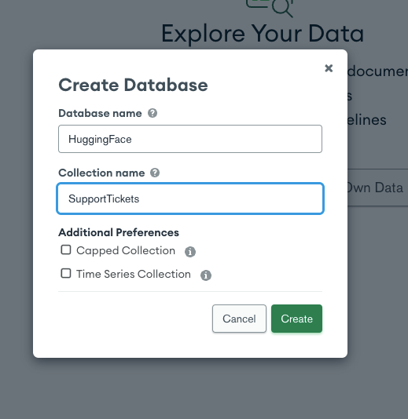


## 2. Create [Database Triggers](https://www.mongodb.com/docs/realm/triggers/database-triggers/)

After we have our database and collection set up we can create a [Database Triggers](https://www.mongodb.com/docs/realm/triggers/database-triggers/), which are automatically invoked when inserting a document into our collection to extend it with a `sentiment-analysis` field.

To get started you need to navigate to "Data Services" Triggers and click "Add Trigger"

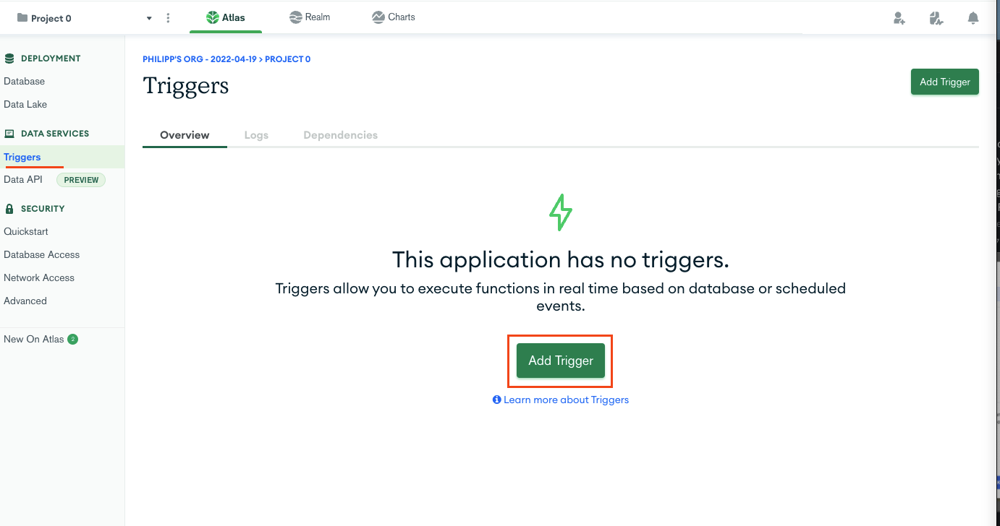

To create our Database Trigger we need to fill in a few details, like a Name (`sentiment_trigger`), Link Data Source, Trigger Source Details.

After we defined the name we can select our cluster in the "Link Data Source" dropdown and hit "link". 
_**NOTE: You need to "link" it otherwise the database and collection won't show up in the trigger source details**_  

After linking our datasource we can seleclt our cluster name, database name and collection name in the "Trigger Source Details" dropdown and select as operation type "insert".

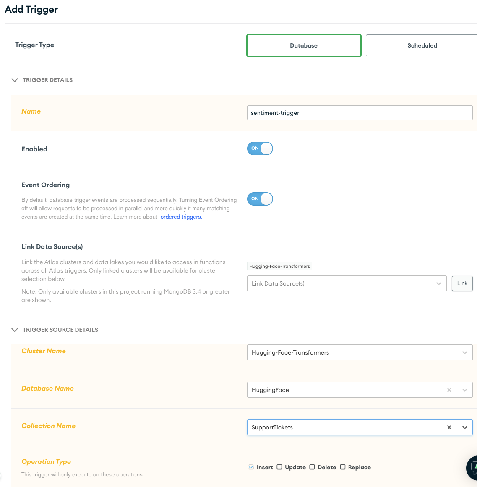

Before we can use our we need to provide a javascript code snippet to invoke the Hugging Face Inference API. This snippet will be executed when a new document is inserted into our collection. Copy the snippet below into the "Function" editor.


```js
exports = async function (changeEvent) {
  const modelId = "distilbert-base-uncased-finetuned-sst-2-english";
  const hfAuthToken = null; // can be relplaced to be not throttled

  const response = await context.http.post({
    url: `https://api-inference.huggingface.co/models/${modelId}`,
    body: { inputs: changeEvent.fullDocument.text },
    encodeBodyAsJSON: true,
  });

  const sentiment = EJSON.parse(response.body.text())[0];
  console.log(JSON.stringify(sentiment))
  
  const collection = context.services
    .get("Hugging-Face-Transformers") // change with your Cluster Name
    .db("HuggingFace") // change with your Database Name
    .collection("SupportTickets"); // change with your Collection Name

  try {
    await collection.updateOne(
      { _id: changeEvent.documentKey._id },
      {
        $set: {
          sentiment,
        },
      }
    );
    console.log("Field updated successfully");
  } catch (err) {
    console.error("Field update failed", err);
  }
  return;
};

```


We can now test our trigger by modifiying the `changeEvent` in the "Console" Tab and then hit run. Copy the snippet below into the Console tab
```js
const changeEvent = {
   documentKey: {_id: "123"},
   operationType: 'insert',
   fullDocument: {
     text: 'credit was to be repaired for myself. the contract included for me making payment, my debts will be paid and my credit score will increase. I received a call from a collector, I tried calling PARK VIEW CREDIT and the line has been disconnected. unable to reach them, I am reaching out to you for assistance',
   }
}
exports(changeEvent);
```

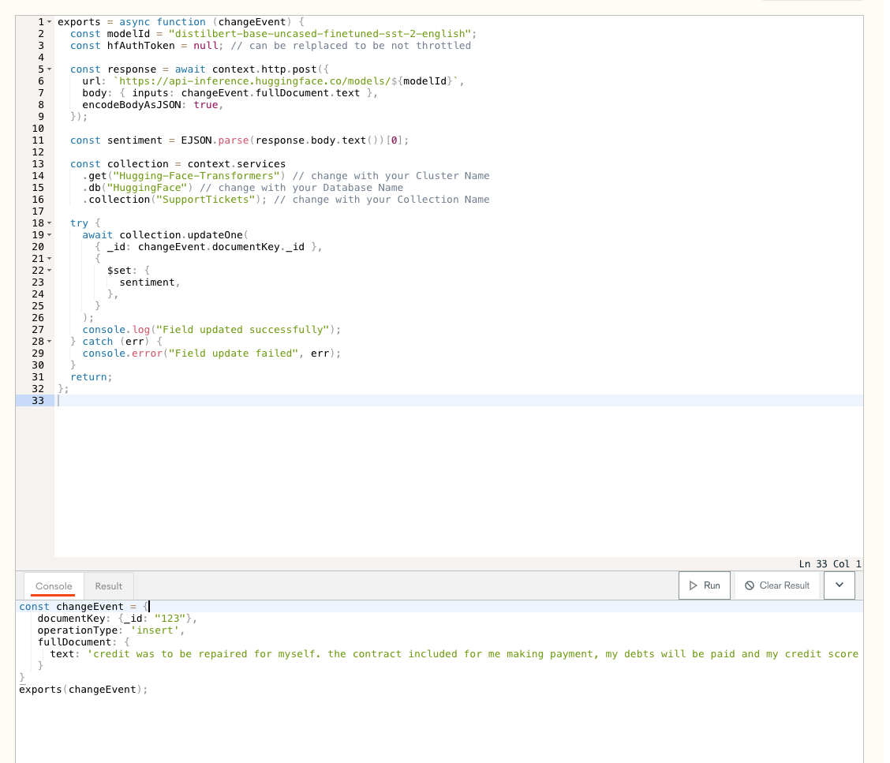

After we have configured our function and test event we can execute and test our trigger by hitting "Run". 

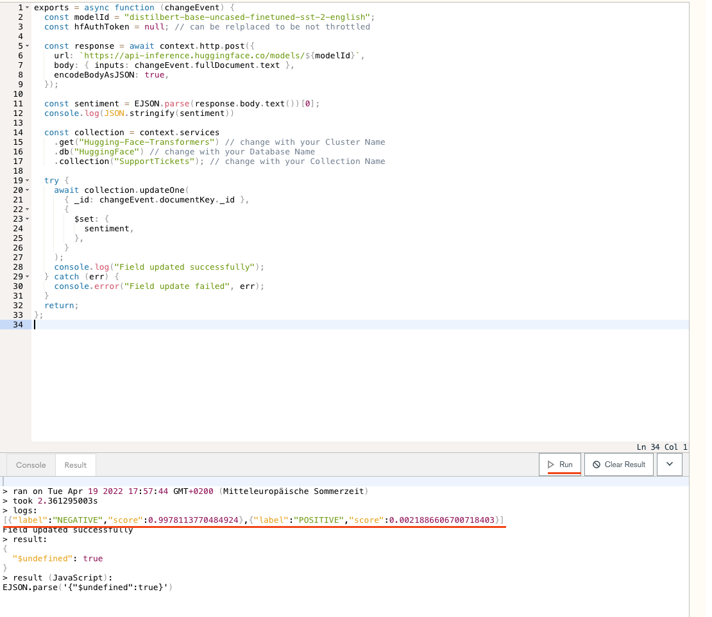

The last step is to hit the "save" button at the bottom of the page and we are done.

Nice work!🚀 

If we go back to the Trigger overview we can see that our Trigger is successfully enabled.

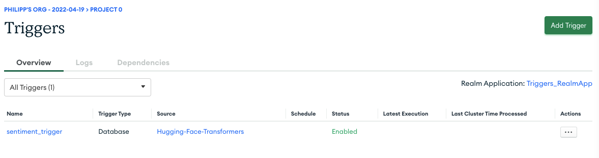


## 3. Test our Database Trigger by insserting new documents

To test our Trigger in Action we can go back to the Database navigation and into our collection and "insert document". 

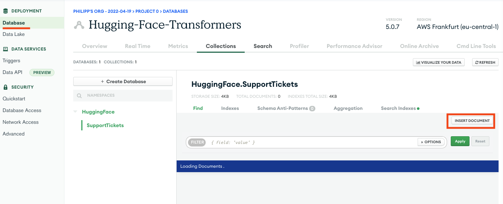

We create a new document and make sure to add a `text` field since that what our trigger is looking for.

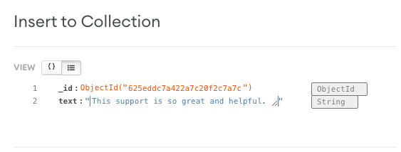

```json
{
    "_id": {
        "$oid": "625eddc7a422a7c20f2c7a7c"
    },
    "text": "This support is so great and helpful."
}
```

After inserting our document we have to refresh the page one time to see that our trigger has added our `sentiment` field. 


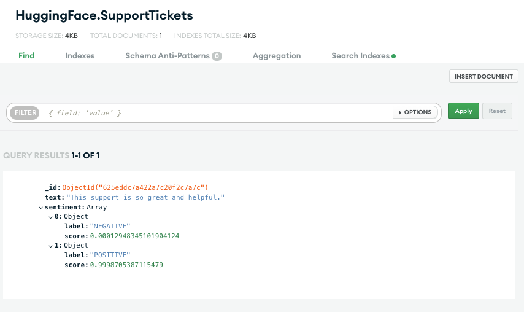

We can also check the logs of our trigger to see the events and how long the execution took. In our case the the execution was `2839ms`, which is probably to slove for real-time use-cases but lets see if we can work with MongoDB to improve the integration of Hugging Face Transformers.

# Resources

* [Documentation: Change Events](https://www.mongodb.com/docs/manual/reference/change-events/)